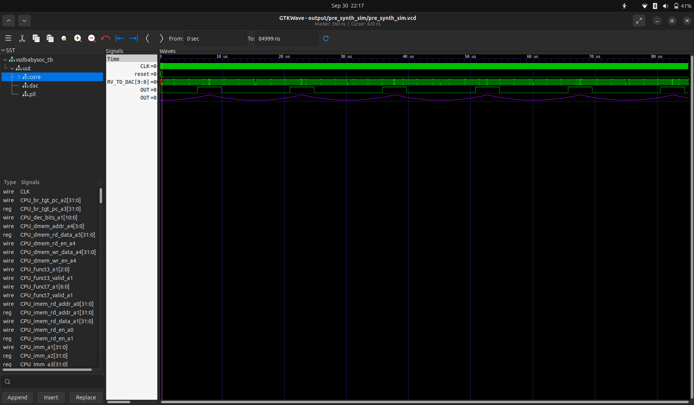
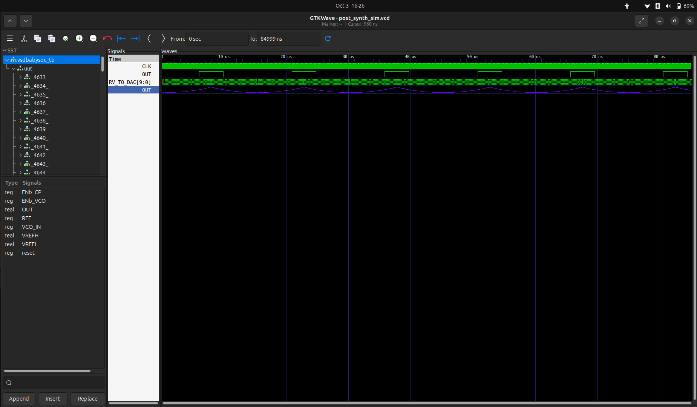

# 🧪 Post-Synthesis Simulation (GLS) – VSDBabySoC

After synthesis, the RTL design is converted into a gate-level netlist mapped to the SKY130 standard cell library. To ensure that the synthesized design is functionally equivalent to the RTL, we run a Post-Synthesis Simulation (GLS).


## 📌 Objective

- Verify functionality of synthesized netlist (vsdbabysoc_net.vs).
- Ensure no mismatches exist between RTL simulation and GLS simulation.
- Check for issues like uninitialized signals (X propagation), timing violations, or library mismatches.


## 📂 Files Required

Before running the iverilog command, copy the necessary standard cell and primitive models: 
These files must be present in the same directory as the testbench (src/module) to resolve all module references during compilation.

```
bash

cp -r ~/VSD/sky130RTLDesignAndSynthesisWorkshop/my_lib/verilog_model/sky130_fd_sc_hd.v .
cp -r ~/VSD/sky130RTLDesignAndSynthesisWorkshop/my_lib/verilog_model/primitives.v .

```

To ensure that the synthesized Verilog file (vsdbabysoc_net.v) is available in the src/module directory for further processing or 
simulation, you can copy it from the output directory to the src/module directory. Here is the step to do that:

```
bash

cp -r ~/VSD_Soc_TapeOut_Program/week2/VSDBabySoC/output/post_synth_sim/vsdbabysoc.synth.v ~/VLSI/VSDBabySoC/src/module/
```


## 🚀 Compilation and Simulation


## 1️⃣ Compile Netlist + Testbench + Libraries


```
bash

iverilog -o \$HOME/VSD_Soc_TapeOut_Program/week2/VSDBabySoC/output/post_synth_sim/post_synth_sim.out -DPOST_SYNTH_SIM -DFUNCTIONAL -DUNIT_DELAY=#1 
	 -I \$HOME/VSD_Soc_TapeOut_Program/week2/VSDBabySoC/src/include 
	 -I \$HOME/VSD_Soc_TapeOut_Program/week2/VSDBabySoC/src/module
	    \$HOME/VSD_Soc_TapeOut_Program/week2/VSDBabySoC/src/module/testbench.v
```
Explanation:
- -I src/include → Ensures header files are included.
- testbench.v → Provides stimulus.
- vsdbabysoc_net.vs → Synthesized design (gate-level).
- sky130_fd_sc_hd.v → Standard cell Verilog models (required for simulation).


## 2️⃣ Run Simulation


```
bash 

output/post_synth_sim/
./post_synth_sim.out
```
- Executes the compiled netlist with testbench.
- Generates a .vcd waveform file for analysis.


## 3️⃣ View Waveforms in GTKWave

```
bash 

gtkwave post_synth_sim.vcd
```
- Compare outputs of Pre-Synth Simulation vs Post-Synth Simulation.
- Ensure waveforms match exactly (ignoring inertial delays).


### Pre-synth Simulation Waveform




### Post-synth Simulation Waveform




## ⚠️ Common Issues in GLS

- Uninitialized signals (X propagation): Often due to flip-flops without reset.
- Mismatch with RTL: May occur if synthesis optimizations removed unused logic.
- Missing standard cell models: Ensure sky130_fd_sc_hd.v is always included.


## ✅ Expected Outcome

- Waveforms of GLS = Waveforms of RTL simulation.
- Confirms that synthesis preserved functional correctness.
- Generated netlist (vsdbabysoc_net.vs) is now verified for use in physical design (PnR).


## 🏁 Conclusion

- Post-synthesis simulation validates that the synthesized gate-level netlist behaves the same as the RTL. This ensures that we can confidently move forward with PnR (Place & Route) and final tape-out steps.
