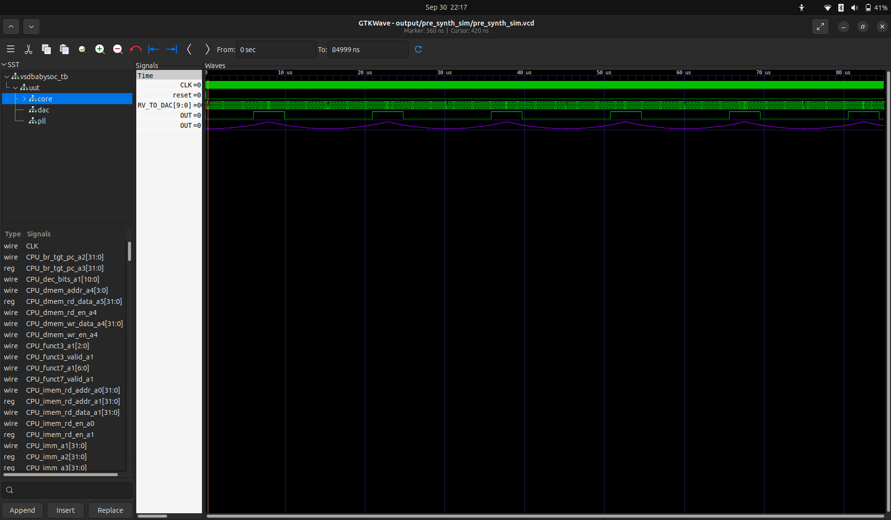

# 🧪 Pre-Synthesis Simulation – VSDBabySoC

## 📖 Overview

- This stage verifies the RTL design functionality before synthesis.
We use Icarus Verilog (iverilog) for simulation and GTKWave for waveform.

- The design under test is VSDBabySoC, which integrates:
1. RISC-V core (rvmyth.v)
2. DAC (avsddac.v)
3. PLL (avsdpll.v)
4. Top-level SoC (vsdbabysoc.v)


## 🛠️ Tools Required

- Icarus Verilog (iverilog) → compile RTL
- vvp → run simulation
- GTKWave → view waveforms

Install them:

```
code:

/VSD_Soc_TapeOut_Program/week2/VSDBabySoC$ sudo apt install iverilog gtkwave -y
```


## 📂 Directory Structure

```
VSDBabySoC/
├── src/
│   ├── include/                # Header files (.vh)
│   │   ├── sandpiper.vh
│   │   ├── sandpiper_gen.vh
│   │   ├── sp_default.vh
│   │   └── sp_verilog.vh
│   ├── module/                 # RTL design files (.v)
│   │   ├── rvmyth.v
│   │   ├── avsddac.v
│   │   ├── avsdpll.v
│   │   ├── vsdbabysoc.v
│   │   └── testbench.v
├── output/
│   └── pre_synth_sim/          # Simulation outputs
└── README.md                   # Documentation

```


## ▶️ Steps to Run Pre-Synthesis Simulation

1. Compile the RTL with Icarus Verilog
```
code:

/VSD_Soc_TapeOut_Program/week2/VSDBabySoC$ iverilog -o output/pre_synth_sim/pre_synth_sim.out -DPRE_SYNTH_SIM -I src/>
```


2. Run the Simulation
```
code:

/VSD_Soc_TapeOut_Program/week2/VSDBabySoC$ ./pre_synth_sim.out 
```


3. View the Waveforms in GTKWave
```
code:

/VSD_Soc_TapeOut_Program/week2/VSDBabySoC$ gtkwave pre_synth_sim.vcd
```




## 📊 Expected Outcome

-  ✅ Functional verification of vsdbabysoc design.
-  ✅ dump.vcd generated successfully.
-  ✅ Waveforms showing RISC-V core signals, DAC, and PLL connections.

