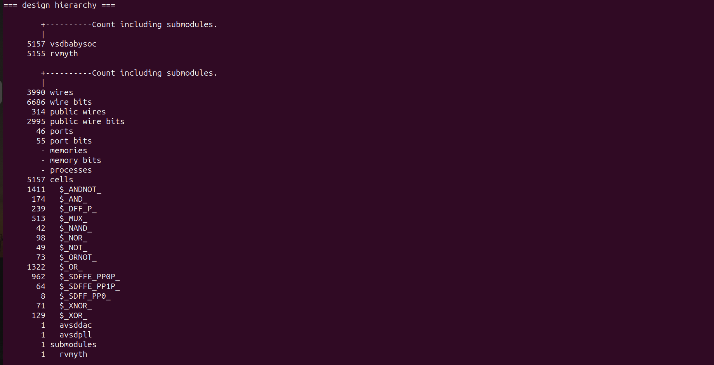
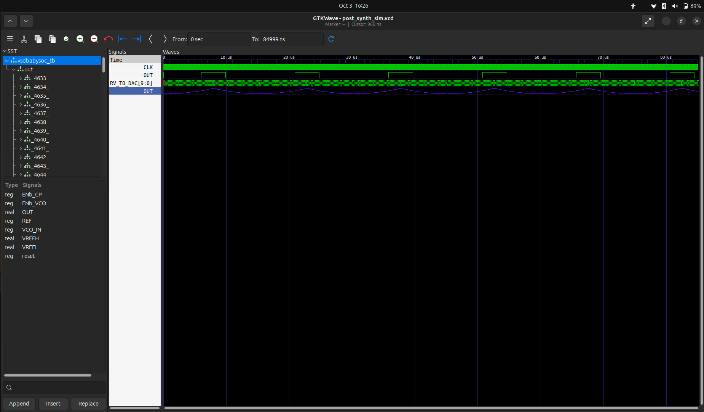

# 🖥️ BabySoC Fundamentals & Functional Modelling — Week 2

<div align="center">


</div>

<div align="center">

📝 RTL Design → 🔄 Synthesis → 🏗️ Physical Design → 🎯 Tapeout Ready

</div>

## 📅 Week 2 — Pre-Synthesis, Synthesis, and Post-Synthesis

This week was dedicated to taking the **RTL design to gate-level representation** using Yosys, validating functional correctness, and preparing the design for physical design flow. The work primarily involved our SoC modules:

- vsdbabysoc.v → Top-level SoC integration module
- rvmyth.v → RISC-V core
- avsdpll.v → PLL module for clock generation
- avsddac.v → DAC module for output conversion


## Introduction to the VSDBabySoC
VSDBabySoC is a small yet powerful RISCV-based SoC.

The main purpose of designing such a small SoC is to test three open-source IP cores together for the first time and calibrate the analog part of it.

VSDBabySoC contains one RVMYTH microprocessor, an 8x-PLL to generate a stable clock, and a 10-bit DAC to communicate with other analog devices.

What is VSDBabySoC?
VSDBabySoC is a compact SoC featuring:

- RVMYTH: A simple RISC-V-based CPU core.
- PLL: An 8x Phase-Locked Loop for stable clock generation.
- DAC: A 10-bit Digital-to-Analog Converter for interfacing with analog devices.
Its primary purpose is to integrate and test these IPs collaboratively and calibrate the analog part of the SoC.


### What is SoC
- An SoC is a single-die chip that has some different IP cores on it. These IPs could vary from microprocessors (completely digital) to 5G broadband modems (completely analog).

### What is RVMYTH
- The RVMYTH core is a simple RISC V-based CPU designed for educational purposes and small-scale applications. It provides a practical example of a RISC-V processor implementation.

### What is PLL
- Phase-Locked Loop (PLL): A phase-locked loop or PLL is a control system that generates an output signal whose phase is related to the phase of an input signal. PLLs are widely used for synchronization purposes, including clock generation and distribution.

### What is DAC
- Digital-to-Analog Converter (DAC): A DAC is a system that converts a digital signal into an analog signal. DACs are widely used in modern communication systems, enabling the generation of digitally-defined transmission signals.


## 📂 Directory Structure

```
VSDBabySoC/
├── src/
│   ├── include/                # Header files (.vh)
│   │   ├── sandpiper.vh
│   │   ├── sandpiper_gen.vh
│   │   ├── sp_default.vh
│   │   └── sp_verilog.vh
│   ├── module/                 # RTL design files (.v)
│   │   ├── rvmyth.v
│   │   ├── avsddac.v
│   │   ├── avsdpll.v
│   │   ├── vsdbabysoc.v
│   │   └── testbench.v
├── output/
│   └── pre_synth_sim/          # Simulation outputs
└── README.md                   # Documentation

```

As this week focus on pre, synth, and post simulations

## 🔄 Pre-Synthesis Simulation (RTL Simulation)

### 📌 Objective

- Verify functional correctness of the RTL design before synthesis.
- Ensure all modules (SoC + Core + DAC + PLL) integrate properly.

1. Compiled the design with iverilog
2. Executed simulation
3. Viewed waveforms in GTKWave


## ⚙️ Synthesis (Yosys)

### 📌 Objective

- Convert the RTL design into a gate-level netlist mapped to SKY130 standard cells.
- Optimize the design for timing, area, and power.




## 🧪 Post-Synthesis Simulation (GLS)
### 📌 Objective

- Validate that the synthesized netlist works the same as the RTL.
- Catch mismatches, uninitialized signals (X), or timing issues.

1. Compile testbench + netlist + standard cell models
2. Run simulation
3. View waveforms in GTKWave




## 🌟 Key Learnings from Week 2

- Understood SoC-level integration of multiple modules.
- Gained hands-on with Yosys synthesis flow using multiple .lib files.
- Verified equivalence between RTL simulation and Gate-Level Simulation (GLS).
- Experienced challenges like missing include files, library mismatches, and fixed them.


## 🙏 **Acknowledgment**

<div align="center">

### 🏆 **Program Leadership & Support**

I am thankful to [**Kunal Ghosh**](https://github.com/kunalg123) and Team **[VLSI System Design (VSD)](https://vsdiat.vlsisystemdesign.com/)** for their continuous guidance and mentorship throughout **Week 2 — Pre-Synthesis, Synthesis, and Post-Synthesis Flow** of the **RISC-V SoC Tapeout Program**.

</div>

---

## 📈 **Weekly Progress Tracker**


### 🚀 **Journey Continues...**

In the upcoming weeks, I will dive into **Physical Design (PD) flow**, timing closure, and finally prepare the SoC for **tapeout readiness** 🚀

---

**🔗 Program Links:**

[](https://vsdiat.vlsisystemdesign.com/)  
[](https://riscv.org/)  
[](https://efabless.com/)

**👨‍💻 Participant:** [krishna-4git](https://github.com/krishna-4git)
