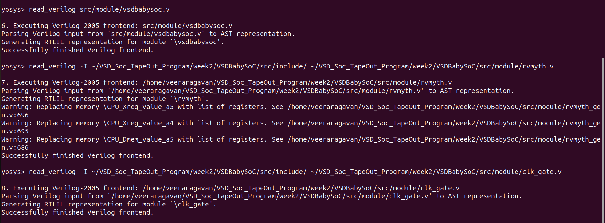
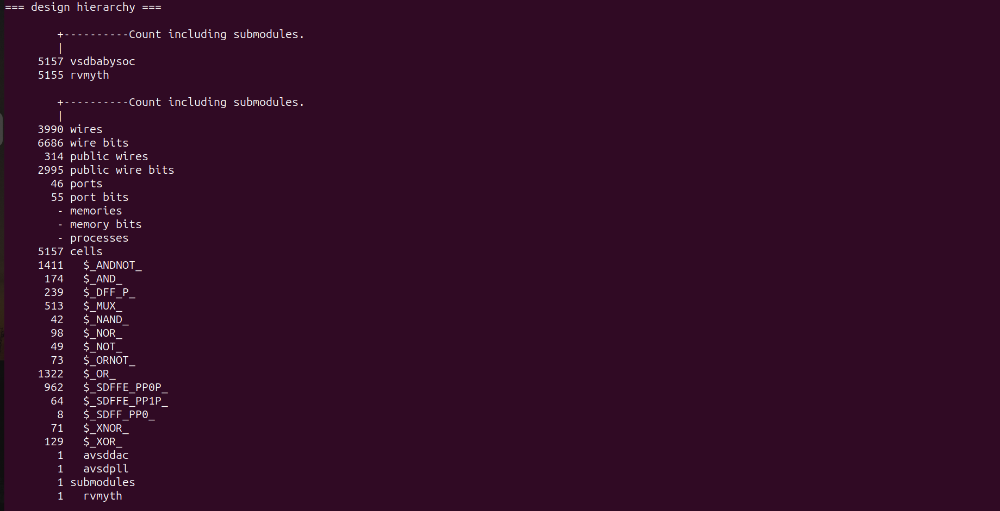
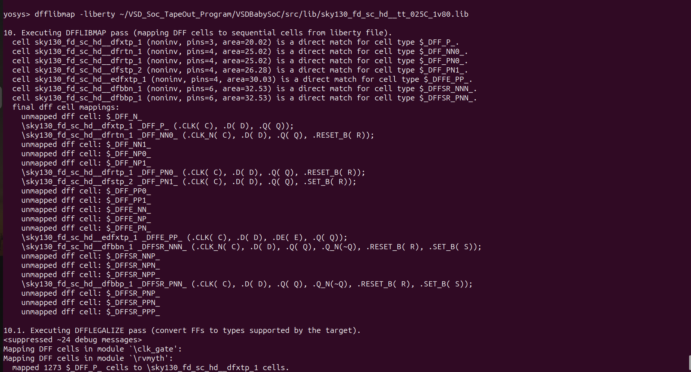
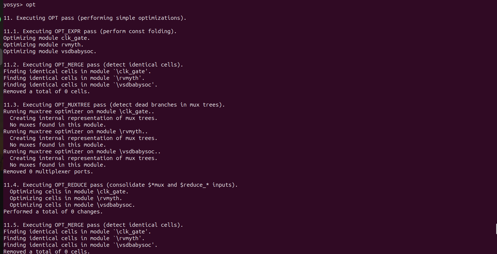
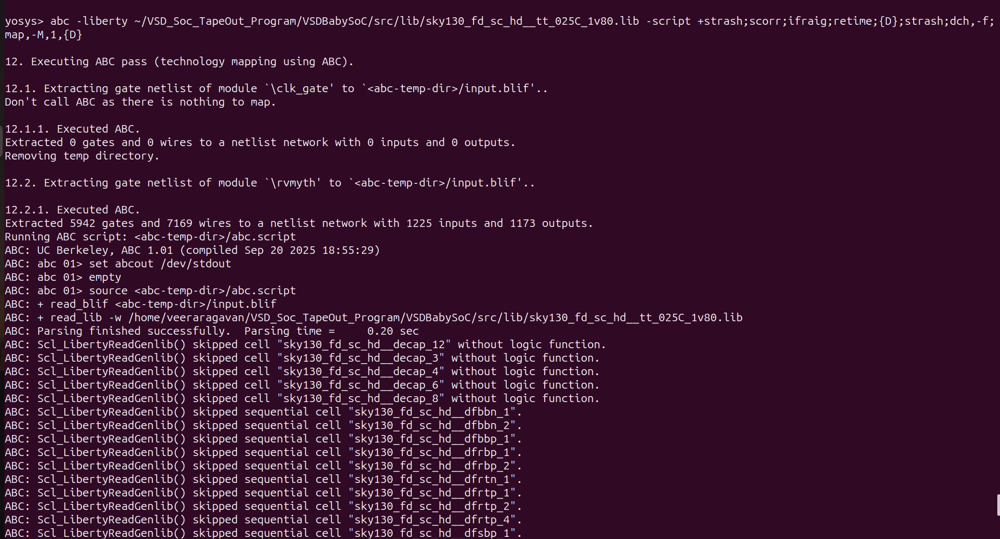
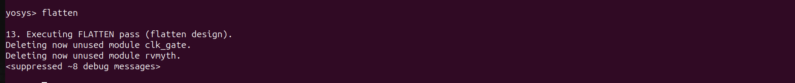
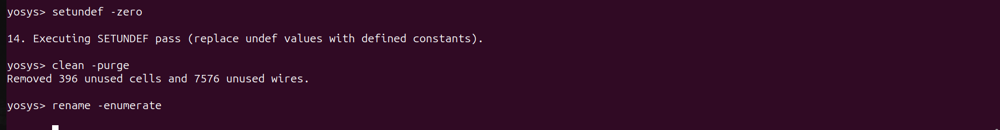
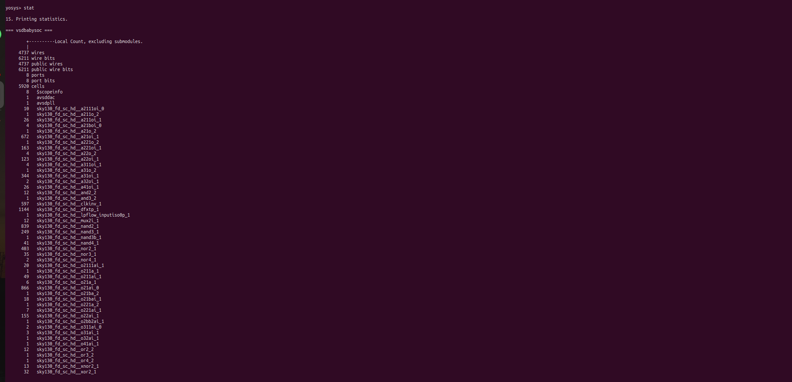
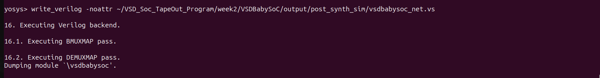

# 🔧 Synthesis Process – VSDBabySoC

- This document explains the complete RTL-to-Gates synthesis flow of the VSDBabySoC using Yosys.

- Synthesis is the process of converting the behavioral/RTL Verilog description of the SoC into a gate-level netlist using standard cell libraries (SKY130 PDK) and custom IP blocks (DAC and PLL).


## 📌 Prerequisites

- Installed Yosys
- RTL Design files in src/module/
- Header/include files in src/include/
- Libraries (.lib) available in src/lib/:
- --->avsdpll.lib – PLL cell library
- --->avsddac.lib – DAC cell library
- --->sky130_fd_sc_hd__tt_025C_1v80.lib – SKY130 standard cell library


##  🚀 Step-by-Step Synthesis Flow


## 1️⃣ Invoke Yosys

```
bash

yosys
```
- This invokes the Yosys interactive shell where all synthesis commands are executed.


## 2️⃣ Load Libraries

```
tcl

yosys> read_liberty -lib ~/VSD_Soc_TapeOut_Program/VSDBabySoC/src/lib/avsdpll.lib
yosys> read_liberty -lib ~/VSD_Soc_TapeOut_Program/VSDBabySoC/src/lib/avsddac.lib
yosys> read_liberty -lib ~/VSD_Soc_TapeOut_Program/VSDBabySoC/src/lib/sky130_fd_sc_hd__tt_025C_1v80.lib

```
- read_liberty -lib → Loads timing and functional models of the cells into Yosys.
- PLL and DAC libs → Define external IPs so that Yosys recognizes them.
- SKY130 .lib → Provides the set of standard cells used for mapping (NAND, NOR, FFs, MUX, INV, etc.).


## 3️⃣ Read RTL Design Files

```
tcl

yosys > read_verilog src/module/vsdbabysoc.v
yosys > read_verilog -I ~/VSD_Soc_TapeOut_Program/week2/VSDBabySoC/src/include/ \
             ~/VSD_Soc_TapeOut_Program/week2/VSDBabySoC/src/module/rvmyth.v
yosys > read_verilog -I ~/VSD_Soc_TapeOut_Program/week2/VSDBabySoC/src/include/ \
             ~/VSD_Soc_TapeOut_Program/week2/VSDBabySoC/src/module/clk_gate.v
```

- vsdbabysoc.v – Top-level SoC wrapper.
- rvmyth.v – CPU core (RISC-V).
- clk_gate.v – Clock gating logic for power saving.
- -I include/ ensures header files like sp_verilog.vh are accessible.





## 4️⃣ Synthesize to Generic Netlist

```
tcl 
 
yosys> synth -top vsdbabysoc
```

- Converts RTL to a generic gate-level netlist (not mapped to tech cells yet).
- Ensures vsdbabysoc is recognized as the top module.





## 5️⃣ Technology Mapping and Optimization


### Dff Mapping 

```
tcl

yosys> dfflibmap -liberty ~/VSD_Soc_TapeOut_Program/VSDBabySoC/src/lib/sky130_fd_sc_hd__tt_025C_1v80.lib
```
- dfflibmap → Replaces generic flip-flops with SKY130 standard-cell flip-flops.




### Optimization

```
tcl

yosys> opt
```
- opt → Performs logic optimizations (constant propagation, dead code removal).





### Technology Mapping

```
tcl

yosys> abc -liberty ~/VSD_Soc_TapeOut_Program/VSDBabySoC/src/lib/sky130_fd_sc_hd__tt_025C_1v80.lib \
    -script +strash;scorr;ifraig;retime;{D};strash;dch,-f;map,-M,1,{D}
```
- abc → The heart of synthesis: maps logic to real SKY130 cells, performs retiming & optimization.





### flatten the Design

```
tcl 

yosys> flatten
```
- flatten → Flattens hierarchy → single-level netlist for easier P&R.





### Unused cells, wires removal

```
tecl

yosys> setundef -zero
yosys> clean -purge
yosys> rename -enumerate
```
- setundef -zero → Replaces all uninitialized signals with logic 0.
- clean -purge → Removes unused signals/cells.
- rename -enumerate → Renames all nets/cells sequentially for readability.





## 6️⃣ Generate Statistics

```
tcl

yosys> stat
```

- Reports number of cells, type of cells, and area estimate.
- Important for analyzing design size and complexity.





## 7️⃣ Write Final Netlist

```
tcl

yosys> write_verilog -noattr ~/VSD_Soc_TapeOut_Program/week2/VSDBabySoC/output/post_synth_sim/vsdbabysoc_net.vs
```

- produces the gate-level Verilog netlist.
- Attributes (-noattr) are removed for clean output.
- Netlist is ready for post-synthesis simulation and physical design flow.





## ✅ Conclusion

At the end of synthesis:
- --->RTL is successfully mapped to SKY130 technology cells.
- --->Netlist (vsdbabysoc_net.vs) is generated for post-synthesis simulation.
- --->Design is now ready for logic verification and physical design (PnR).
